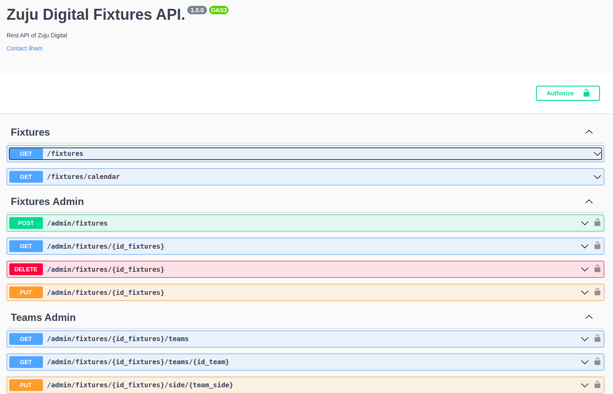
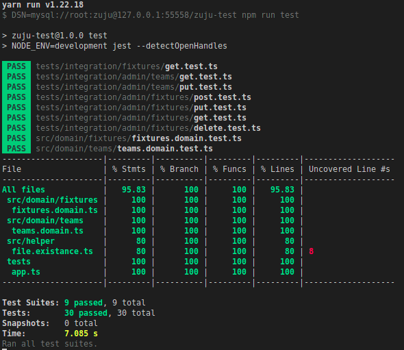

# Zuju Digital Code Submission


## Prerequisite
1. Docker installed. I use docker with version 20.10.21
2. Docker Compose installed. I use docker compose with version 2.12.2
3. NodeJS. I use Node 16

## Running Locally
Below are some way to run this application locally
### Using Docker
1. Install Node JS dependency
```
npm install
```
2. Navigate to docker folder
```
cd build/docker
```

3. Run docker image build for local development
```
docker compose build zuju-test
```

4. Run docker services
```
docker compose up -d
```

5. After All service running, open ```http://localhost:31080``` or direct to the docs ```http://localhost:31080/api-docs``` (31080 is docker published port)

### Using NPM
1. Install Node JS dependency
```
npm install
```
2. Create .env file from .env.example if .env is not exists
```
cp .env.example .env
```
3. Edit .env file based on your environment (ex: database, port listening, etc). These below are configurable env variables for the application
```
LISTEN_HOST=0.0.0.0
LISTEN_PORT=1321
DSN=mysql://localhost:3306/zuju
ALLOWED_CORS_DOMAIN=*

BASIC_AUTH_USERNAME=admin
BASIC_AUTH_PASSWORD=supersecretauth

```
4. Run database migration by using this code below. Please make sure that your database connection value has been added to ```DSN``` environment var on your .env file.

```
npm run migrate
```
5. After database migrated, to insert data seed, run this command below.
```
npm run seed
```
6. Run this application locally by running this command below
```
npm run dev
```
7. Open ```http://localhost:{LISTEN_PORT}``` or direct to the docs ```http://localhost:{LISTEN_PORT}/api-docs``` (1321 is port config from .env).
If your app listen to  using 1321 port, then you can open the app on ```http://localhost:1321```

## Build The Application
Below are some way to build this app
### Using Docker
1. Navigate to docker folder
```
cd build/docker
```
2. Run docker production build command below
```
docker compose -f docker-compose.yml -f docker-compose.production.yml build zuju-test
```
3. After docker build script finished, you will find a docker image with ```ilhamfadhilah/zuju-test``` name and ```1.0.0``` tag.
4. You can run the production image by using this command below
```
docker compose -f docker-compose.yml -f docker-compose.production.yml up -d
```

### Using NPM
1. Build this app using this command below
```
npm run build
```
2. When the build process finished, a folder named ```dist``` will be shown.
3. Run this command to run the app based on the production build code.
```
npm run start:production
```

## Auth For Restricted API
### Basic Auth
When you accessing restricted API endpoints, you have to use basic auth. Below is the static credentials and it can be edited on .env file
Credentials (By Default):
```
username: admin
password: supersecretauth

```
## Test The Application
To run unit test and integration test for the application, you can run these command below

### Using NPM
1. Create .env.test file from .env.example if .env.test is not exists
```
cp .env.example .env.test
```
2. Edit .env.test file based on your environment (ex: database, port listening, etc). These below are configurable env variables for the application
```
LISTEN_HOST=0.0.0.0
LISTEN_PORT=1321
DSN=mysql://localhost:3306/zuju-test
ALLOWED_CORS_DOMAIN=*

BASIC_AUTH_USERNAME=admin
BASIC_AUTH_PASSWORD=supersecretauth

```
3. Run database test migration by using this code below. Please make sure that your database connection value has been added to .env.test file value (```DSN```).

```
npm run test:migrate
```
4. Run the test locally by using this command
```
npm run test
```

## Screenshots

### Swagger Endpoint List


### Unit Test and Integration Test Result

